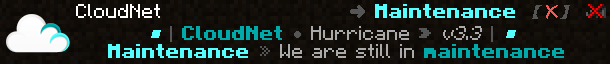

The SyncProxy module manages the Motd, and the tab list header and footer.
  


## Maintenance
The module also has maintenance mode with a whitelist or a permission.  

:::caution Warning
Due to missing features in BungeeCord, the permission only works in combination with our [CloudPerms Module](cloudperms.md)!

## Configuration
The configuration file is located under the following path: `modules/CloudNet-SyncProxy/config.json`

### loginConfigurations
This is a json array containing a loginConfiguration for each Proxy group (`targetGroup`).

#### targetGroup
This is the Proxy group to which the settings will be applied

#### motds
This is a json array containing the different MOTDs which are randomly selected.
:::tip
If you want to turn off MOTDs empty the array. This should look like this: `"motds": [],`
:::

#### maintenanceMotds
This is a json array containing the different maintenance MOTDs which are randomly selected, if the SyncProxy maintenance is enabled.
:::tip
If you want to turn off maintenance MOTDs empty the array. This should look like this: `"maintenanceMotds": [],`
:::

<br></br>

### tabListConfigurations
This is a json array containing a tabListConfiguration (header/footer) for each Proxy group (`targetGroup`)

#### targetGroup
This is the Proxy group to which the settings will be applied.

#### entries
This is a json array containing entries for the header & footer.  
To create an animation you have to add multiple entries.

## Tablist placeholder
```
%proxy% ---------------------- The name of the proxy the player is connected to
%proxy_uniqueId% ------------- The UUID of the proxy the player is connected to
%server% --------------------- The name of the server the player is connected to
%online_players% ------------- The current amount of online players on the network
%max_players% ---------------- The current amount of max players on the network
%proxy_task_name% ------------ The name of the task of the proxy the player is connected to
%name% ----------------------- The name of the player
%ping% ----------------------- The current ping of the player
%time% ----------------------- The current time - Format: Hour:Minute:Second
%group% ---------------------- The name of the players highest permission group (Only with the CloudPerms module)
%prefix% --------------------- The prefix of the players highest permission group (Only with the CloudPerms module)
%suffix% --------------------- The suffix of the players highest permission group (Only with the CloudPerms module)
%display% -------------------- The display of the players highest permission group (Only with the CloudPerms module)
%color% ---------------------- The color of the players highest permission group (Only with the CloudPerms module)
```

## MOTD placeholder
```
%proxy% ---------------------- The name of the proxy the MOTD has been sent from
%proxy_uniqueId% ------------- The uniqueId of the proxy the MOTD has been sent from
%task% ----------------------- The name of the task of the proxy the MOTD has been sent from
%node% ----------------------- The node of the proxy the MOTD has been sent from is running on
%online_players% ------------- The current amount of online players on the network
%max_players% ---------------- The current amount of max players on the network
```

## Sample Configuration
The default configuration of the SyncProxy Module looks like this:
```json
{
  "config": {
    "loginConfigurations": [
      {
        "targetGroup": "Proxy",
        "maintenance": true,
        "maxPlayers": 100,
        "whitelist": [],
        "motds": [
          {
            "firstLine": "         &b&o■ &8┃ &3&lCloudNet &8● &7Earthquake &8&l» &7&ov3.4 &8┃ &b&o■",
            "secondLine": "    &7Powered by &8● &b&lOpusX.io &8▎  &3&l&o%proxy%",
            "autoSlot": true,
            "autoSlotMaxPlayersDistance": 1,
            "playerInfo": [
              " ",
              "&3&lCloudNet &8● &7your &bfree &7cloudsystem",
              "&7Sponsored by &8» &bOpusX.io",
              "&7Discord &8» &fdiscord.gg/CPCWr7w",
              " "
            ],
            "protocolText": null
          }
        ],
        "maintenanceMotds": [
          {
            "firstLine": "         &b&o■ &8┃ &3&lCloudNet &8● &7Earthquake &8&l» &7&ov3.4 &8┃ &b&o■",
            "secondLine": "    &b&lMaintenance &8» &7We are still in &3&lmaintenance",
            "autoSlot": true,
            "autoSlotMaxPlayersDistance": 1,
            "playerInfo": [
              " ",
              "&3&lCloudNet &8● &7your &bfree &7cloudsystem",
              "&7Sponsored by &8» &bOpusX.io",
              "&7Discord &8» &fdiscord.gg/CPCWr7w",
              " "
            ],
            "protocolText": "&8➜ &b§lMaintenance &8&l&o【&c✘&8&l&o】"
          }
        ]
      }
    ],
    "tabListConfigurations": [
      {
        "targetGroup": "Proxy",
        "entries": [
          {
            "header": " \n &b&o■ &8┃ &3&lCloudNet &8● &7Earthquake &8&l» &7&o%online_players%&8/&7&o%max_players% &8┃ &b&o■ &f \n &8► &7Current server &8● &b%server% &8◄ \n ",
            "footer": " \n &7Powered by &8&l» &bOpusX.io &8▎ &7Discord &8&l» &bdiscord.gg/UNQ4wET \n &8&o◣ &7&onext &3&l&ogeneration &7&onetwork &8&o◥ \n"
          }
        ],
        "animationsPerSecond": 1.0
      }
    ],
    "messages": {
      "player-login-full-server": "&cThe network is currently full. You need extra permissions to enter the network",
      "player-login-not-whitelisted": "&cThe network is currently in maintenance!",
      "service-start": "&7The service &e%service% &7is &astarting...",
      "service-stop": "&7The service &e%service% &7is &cstopping..."
    },
    "ingameServiceStartStopMessages": true
  }
}
```